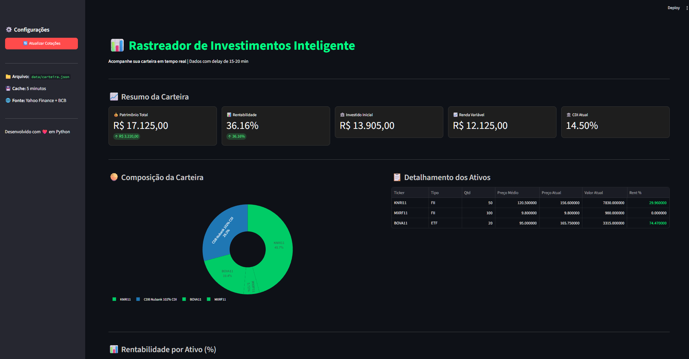

# 📊 RDII - Rastreador de Investimentos Inteligente

[](https://python.org)
[](https://streamlit.io)
[](https://finance.yahoo.com)
[](LICENSE)

> Dashboard interativo para acompanhamento de carteira de investimentos em tempo real (delay 15-20 min), com dados da B3 via Yahoo Finance e taxas do Banco Central do Brasil.



---

## 🚀 Funcionalidades

- ✅ **Cotações em tempo real** de ações, FIIs e ETFs da B3
- ✅ **Rentabilidade calculada automaticamente** (preço médio vs. preço atual)
- ✅ **Gráficos interativos** (composição da carteira, rentabilidade por ativo)
- ✅ **Dados oficiais do BCB** (CDI, SELIC, IPCA)
- ✅ **Cache inteligente** (evita requisições excessivas à API)
- ✅ **Interface web responsiva** via Streamlit

---

## 📸 Preview

| Resumo da Carteira | Composição | Rentabilidade |
|---|---|---|
| Patrimônio, rentabilidade, CDI | Gráfico de rosca interativo | Gráfico de barras por ativo |

---

## 🛠️ Tecnologias

| Tecnologia | Uso |
|---|---|
| **Python 3.14** | Linguagem principal |
| **Streamlit** | Dashboard web |
| **Plotly** | Gráficos interativos |
| **Pandas** | Manipulação de dados |
| **yfinance** | Cotações Yahoo Finance |
| **Requests** | API do Banco Central |

---

## 📦 Instalação

```bash
# 1. Clone o repositório
git clone https://github.com/seu-usuario/rdii.git
cd rdii

# 2. Crie o ambiente virtual
python -m venv venv

# 3. Ative (Windows)
venv\Scripts\activate

# 4. Instale as dependências
pip install -r requirements.txt

# 5. Configure sua carteira
# Edite o arquivo data/carteira.json com seus investimentos

# 6. Execute o dashboard
streamlit run src/dashboard.py